# TASK 2: API
- - -
An API (Application Programming Interface) is basically a set of rules that lets different software applications talk to each other. 
Instead of building every feature from scratch you can just request data or services from external systems that already have it. 
You see APIs everywhere — **weather apps, payment gateways, Google Maps, social media logins** 
For this task I used the **OpenWeatherMap API** to build a **Weather Dashboard** that fetches and displays real-time weather data.
It gives the following details 
* temperature
* humidity
* wind speed 
## Images
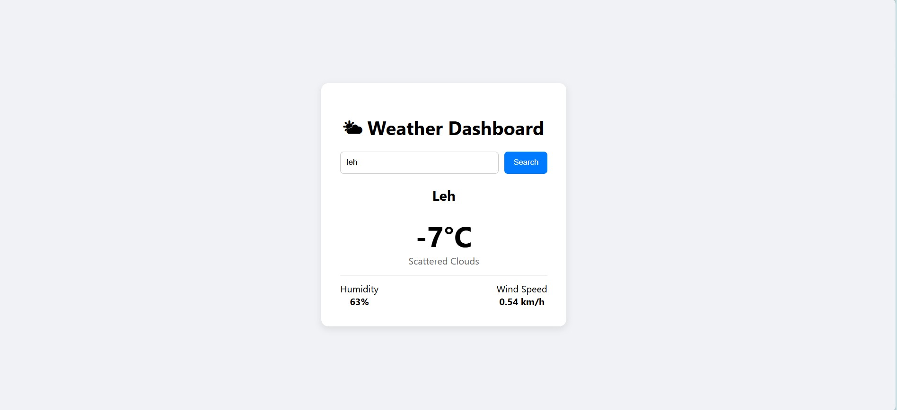
- - - 
I also experimented with building a **Simple Virus Scanner** using the **VirusTotal API** where a user can enter a URL and the app submits it report. 

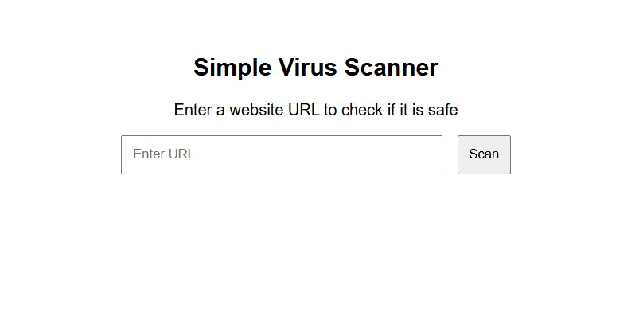

[Github link](https://github.com/hunter-bradley-akash-code/API.git)
- - -
# TASK 3: Working with Github
- - -
In this task I learned how to use Git and GitHub to fix an issue in a repository and contribute through a pull request. The repository contained a Python file (`main.py`) with a function that adds two numbers which had an error. I edited the file and corrected the code so that it properly returns the sum of the two numbers.
After fixing the issue I committed the changes to a branch and created a pull request on GitHub. This task helped me understand how to identify bugs edit files in a repository, commit changes and contribute to a project using GitHub.
## Images
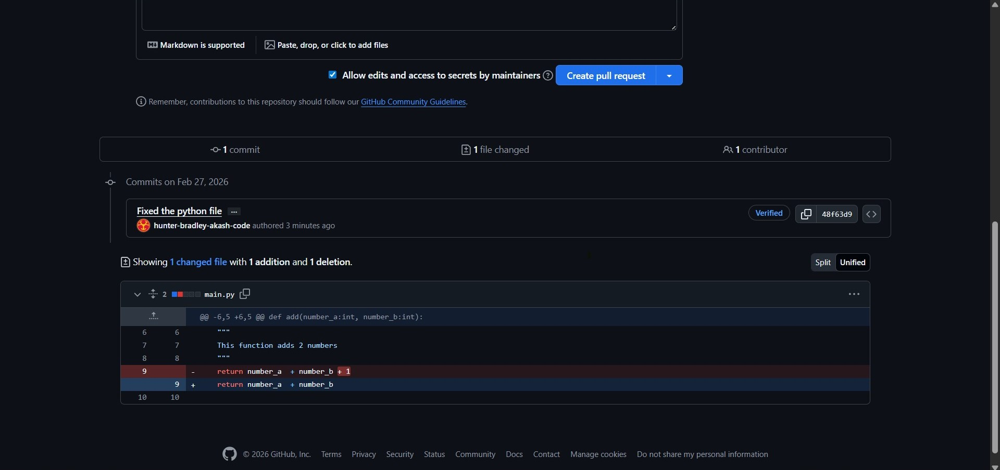

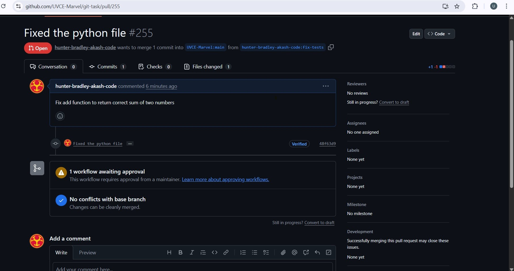

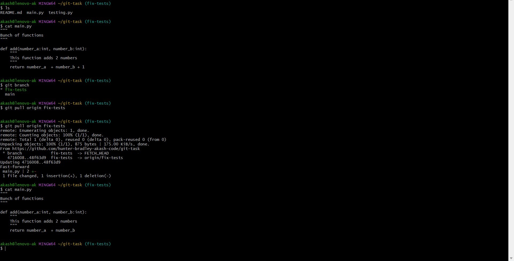
- - -

# TASK 4: Get familiar with the command line on ubuntu
- - - 
In this task I learned how to work with files using basic Linux terminal commands. I navigated to a directory using commands like `cd` and checked the files using `ls`. Then I created and edited text files (`AK.txt` and `AK2.txt`) using the `vim` editor and added some text to them. After saving the files I used the `cat` command to display their contents. I also used `cat AK.txt AK2.txt` to view the contents of both files together. This task helped me understand basic file creation, editing and viewing operations in the Linux terminal.

## Images
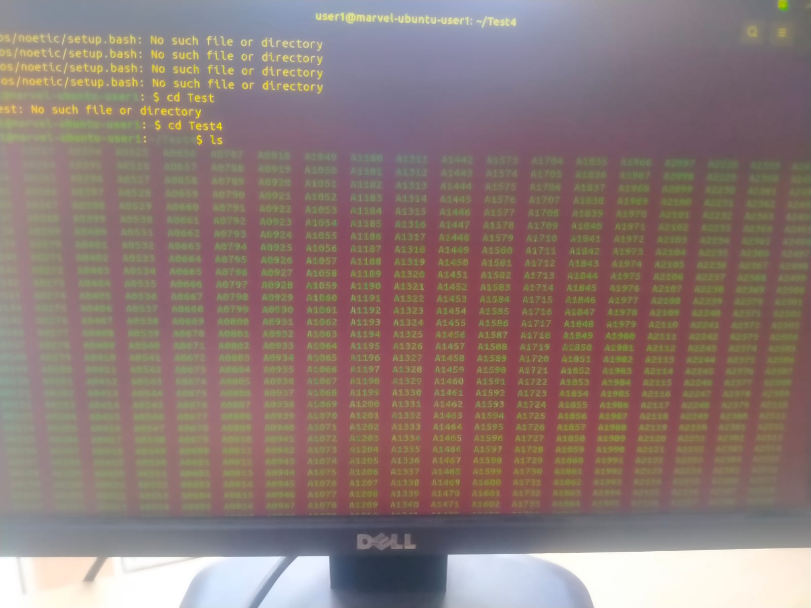

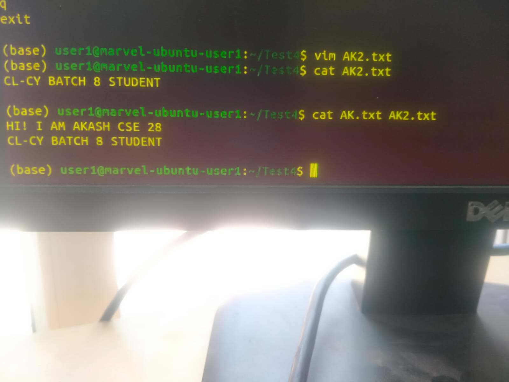
- - -
# Task 6 : The Matrix Puzzle
- - -
In this task, I used Python with NumPy and Matplotlib to decode an encoded array. The array was loaded from a `.npy` file and 
its shape and total elements were checked. Then the array was reshaped into a 100 × 100 matrix and rotated to get the correct orientation.
Finally the decoded image was displayed.
## Images
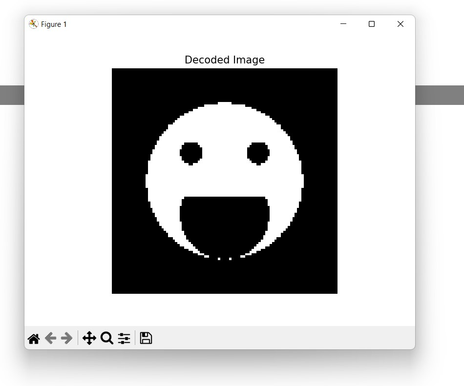

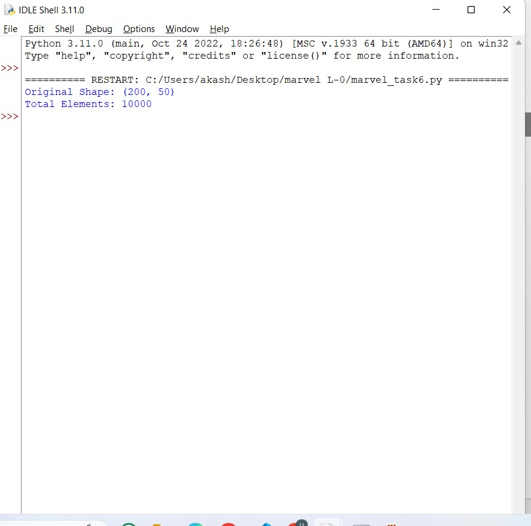
- - - 
# TASK 7: Create a Portfolio Webpage
- - -
In this task I created a personal portfolio website to showcase my skills and projects. 
The website includes sections like Home, About Me, Interests, Projects and Contact. 
It was built using HTML, CSS and JavaScript.This task helped me understand how to design and organize a personal website to present my work.
## Images

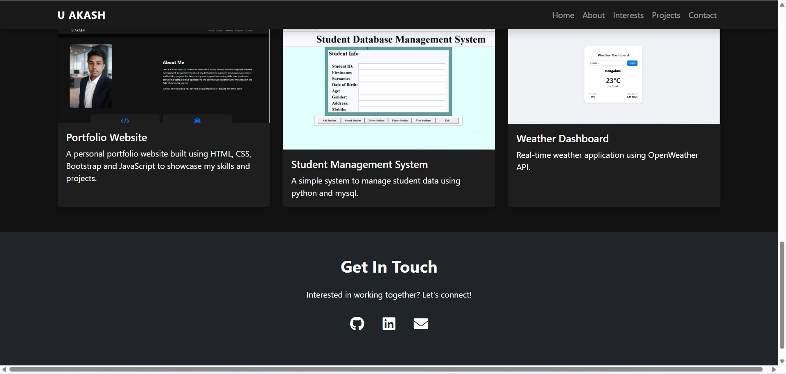
click [here]() to view the website
- - -
# TASK 8: Writing Resource Article using Markdown
- - - 
In this task I created a resource article using Markdown about the MQ135 Gas Sensor. 
The article explains the sensor’s introduction, detectable gases, technical specifications, construction, working principle, pin configuration, Arduino interfacing, applications, advantages and limitations. 
Markdown formatting was used to organize the content with headings, lists, tables and code blocks. 
This task helped me learn how to write structured technical documentation and present hardware information clearly using Markdown.

[report](https://github.com/hunter-bradley-akash-code/task8-marvel.git)
- - -
# Task 9: Tinkercad

In this task I created a Tinkercad account and explored the platform to understand basic circuit simulations. 
I first studied the example circuits and then simulated a simple circuit using an ultrasonic sensor to measure the distance between the sensor and an obstacle. 
I also created a radar system using an ultrasonic sensor and a servo motor where the servo rotates the sensor to scan a wider area and detect objects within range. 
This task helped me understand sensor simulation and basic hardware interfacing using Tinkercad.
 ## Images
 
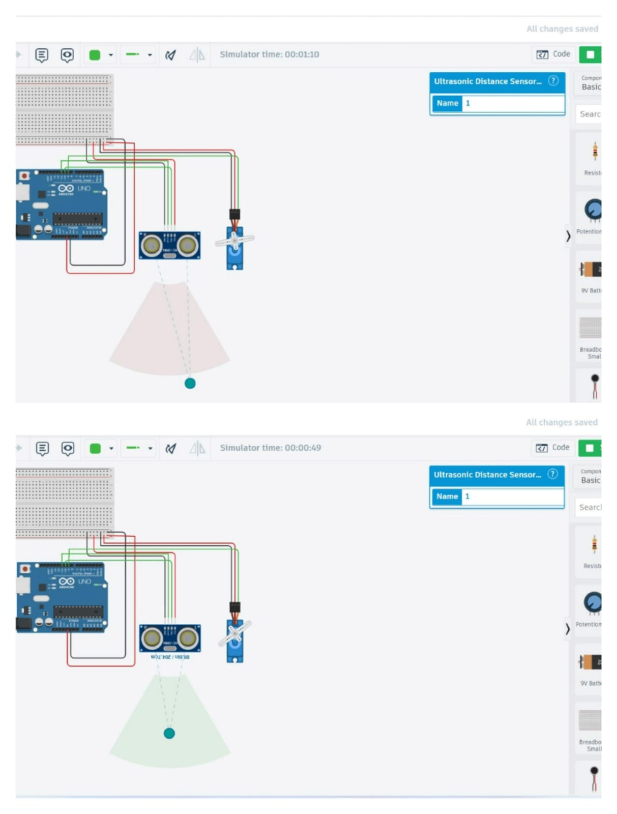

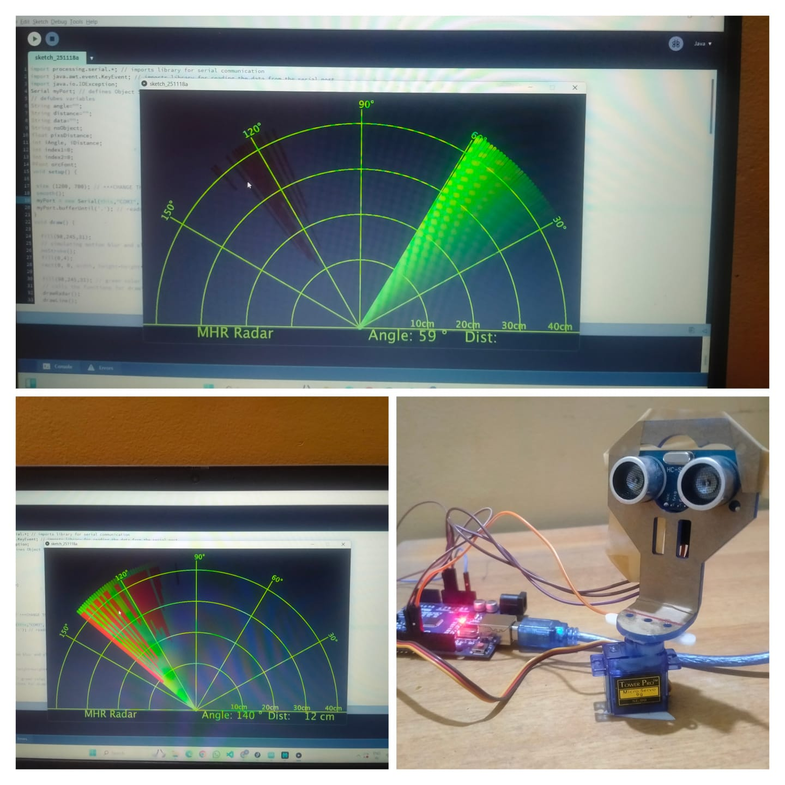

[video link](tinkercad(video).mp4)
- - -
# TASK 10: Speed Control of DC Motor

In this task I controlled the speed of a DC motor using an Arduino Uno and a motor driver module. 
The motor driver was connected between the Arduino and the DC motor to safely control the motor. 
PWM signals from the Arduino were used to vary the motor speed by changing the duty cycle. 
Different speed values were programmed in the code to increase and decrease the motor speed at intervals. 
This task helped me understand PWM-based motor speed control and interfacing motors with Arduino.
## Images
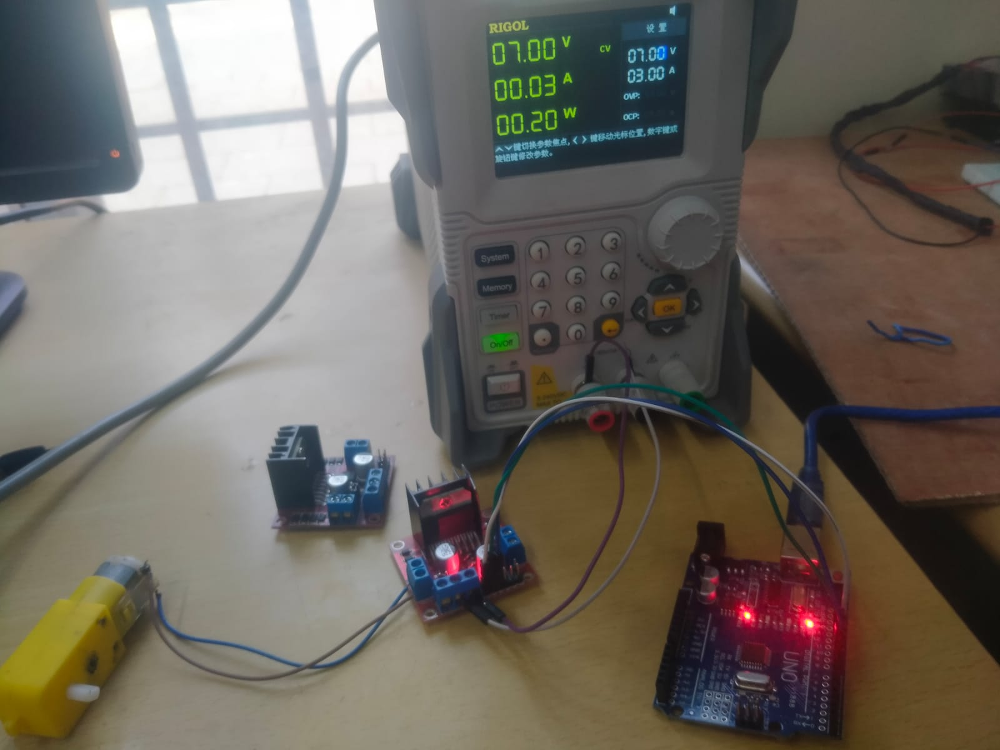

[video link](dcmotor(video).mp4)
- - -
# TASK 11: LED Toggle Using ESP32

In this task I controlled LEDs using an ESP32 microcontroller through a web interface. 
The ESP32 was connected to two LEDs on a breadboard using resistors. After connecting the ESP32 to a WiFi network a simple web server was created that allowed the LEDs to be turned ON or OFF from a mobile phone browser. 
When the user presses the button on the webpage the ESP32 receives the request and toggles the LED state accordingly. 
This task helped me understand ESP32 WiFi capabilities IoT-based device control, and web server communication with hardware.

## Images

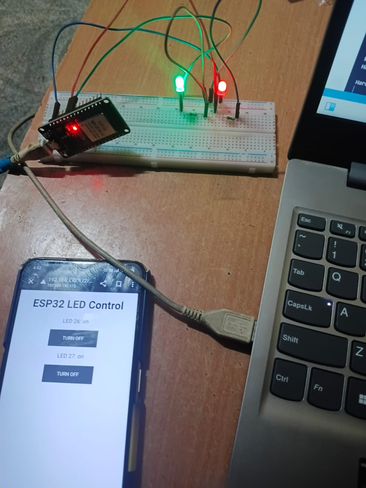

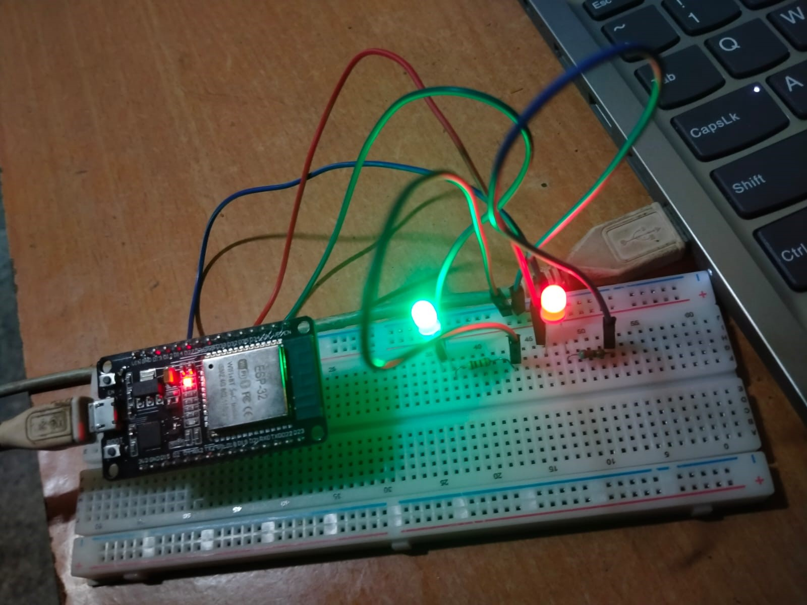
- - -
# TASK 12: Soldering Prerequisites

In this task I became familiar with basic soldering equipment such as the soldering iron, solder wire, rosin flux, holder etc...
I practiced by desoldering an LED and soldering it back again. 
This helped me understand proper soldering techniques, heat control and safe handling of electronic components.

## Images

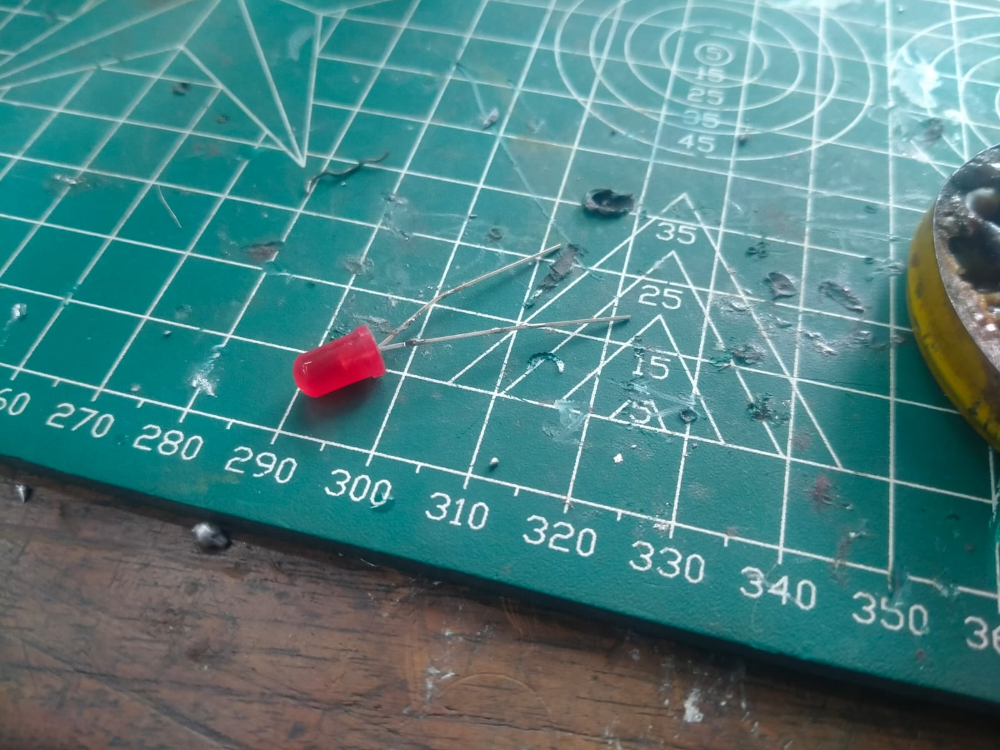

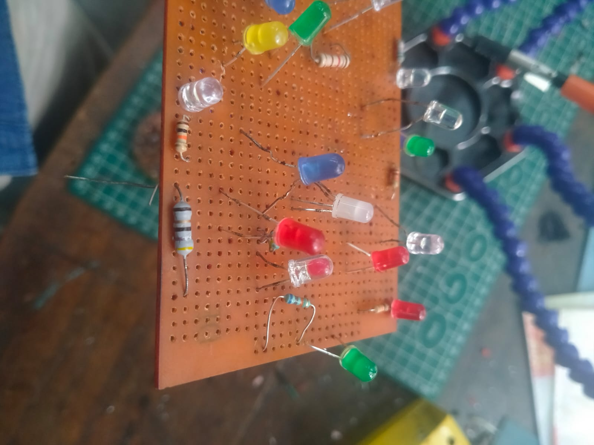
- - -
# TASK 14: Karnaugh Maps and Deriving the logic circuit
- - -
In this task I learned how to simplify Boolean expressions using Karnaugh Maps (K-Maps). 
A truth table was first created using the variables D (Door), K (Key) and A (Alarm). Based on the truth table a Karnaugh Map was drawn to simplify the Boolean expression.
The simplified expression obtained was A = D · K̅. Using this expression the corresponding logic circuit was designed using a NOT gate for K and an AND gate with input D and 
K̅ to generate the alarm output. This task helped me understand logic simplification and how to implement the simplified expression using digital logic gates.

## Images
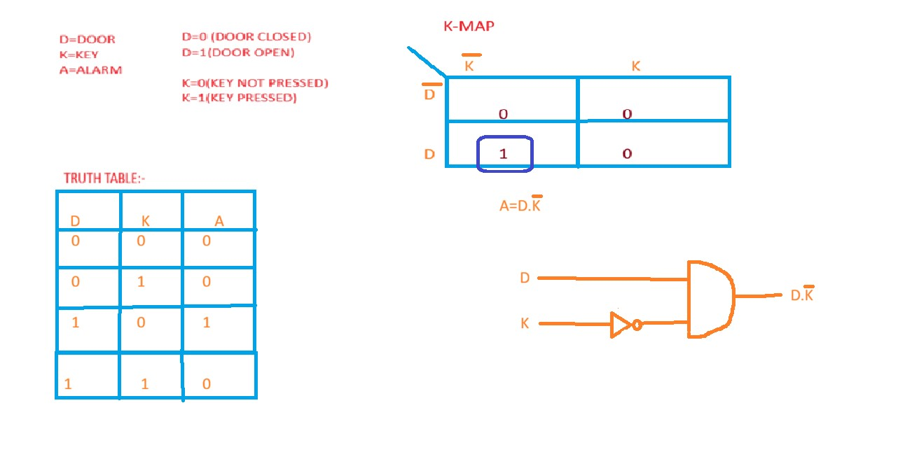

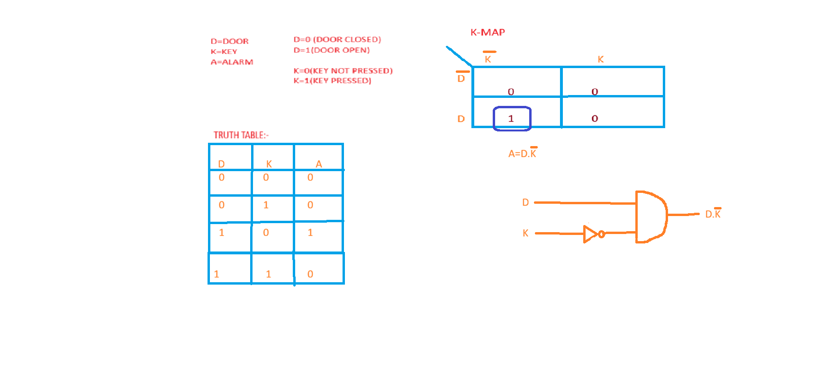
- - -
